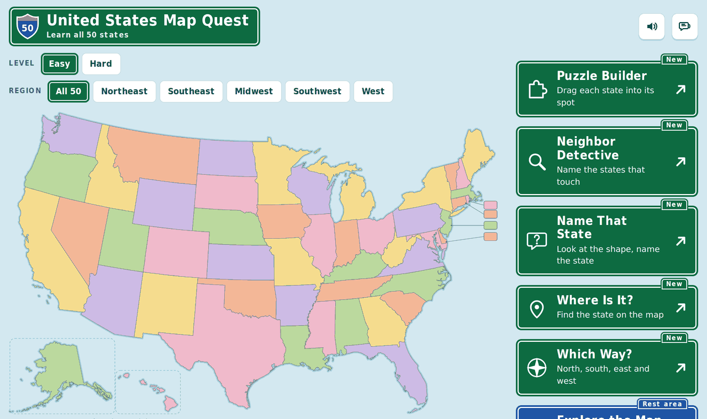
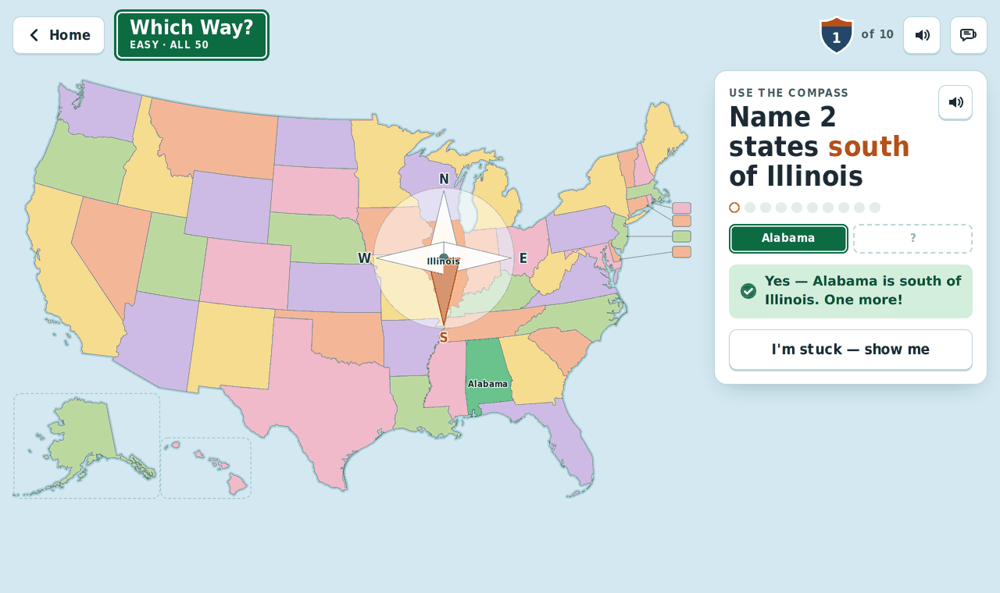

# United States Map Quest

A free map game that teaches elementary schoolers (grades K–5) all 50 U.S. states.

**The whole game is one HTML file.** Download [`index.html`](index.html), open it in any browser, and it works — no install, no account, no internet connection. Good for classroom laptops and Chromebooks on a slow day, or a tablet on a plane.



## The six activities

| | |
|---|---|
| **Puzzle Builder** | Drag each state into its place on a blank map, like a jigsaw. |
| **Neighbor Detective** | "Which states touch Kansas?" — find all of them. |
| **Name That State** | A state lights up; name it from its shape. |
| **Where Is It?** | "Find Colorado" — tap it on the map. |
| **Which Way?** | Compass practice: "Alabama is ____ of Tennessee", "Name 2 states west of Colorado", "Arkansas is west of which state?" |
| **Explore the Map** | A study mode: tap any state for its name, capital and neighbors. |



## Two levels, and smaller maps

- **Easy** — tap to answer, names shown on puzzle pieces, four cardinal directions, extra hints after a miss.
- **Hard** — type state names (small spelling mistakes are forgiven), no names on the pieces, and all eight directions including northeast, northwest, southeast and southwest.
- **Regions** — play the whole country or just the Northeast, Southeast, Midwest, Southwest or West, so a first grader isn't facing 50 pieces at once.

Rounds are 10 questions and end with 1–3 stars, a list of states to practice, and confetti. Best scores are remembered in the browser.

## Sound and reading

Questions can be read aloud using the voices already on the computer, so pre-readers can play; there's a speaker button to hear a question again. Sound effects are generated in the browser (nothing is downloaded), and both can be switched off — worth doing in a room full of laptops.

## Is the geography right?

- State outlines come from the U.S. Census Bureau's cartographic boundary files (public domain), by way of [us-atlas](https://github.com/topojson/us-atlas).
- Neighbor answers are the standard land borders taught in school. They were cross-checked against the borders computed from the map itself — the two agree exactly. States that meet only at a corner (Arizona and Colorado, Utah and New Mexico) do not count as neighbors.
- Direction questions use each state's true center in latitude and longitude, and a question is only asked when the answer is unmistakable and the map view agrees with it.
- All 50 capitals were checked to fall inside their own state.
- Alaska and Hawaii are drawn in inset boxes, so their position on the map is not their real position. They are left out of direction questions, and tapping them says why.

## Playing it online

Any web host works, since it's a single file. To use GitHub Pages: **Settings → Pages → Source: Deploy from a branch → branch `main`, folder `/docs`**. The game is already at `docs/index.html`.

## Building from source

The single file is assembled from the pieces in `src/`. Python 3 is all you need — no packages to install.

```bash
python3 build/build_data.py   # map outlines, neighbors, centers, capitals -> src/data.js
python3 build/build.py        # inlines CSS, font, data and code -> us-map-quest.html
```

| Path | What it is |
|---|---|
| `src/body.html`, `src/style.css`, `src/app.js` | Page markup, styles, and the game engine |
| `src/data.js` | Generated map data: outlines, neighbors, regions, capitals, centers |
| `build/build_data.py` | Turns the Census map file into `src/data.js` |
| `build/topo.py` | Small TopoJSON reader (no dependencies) |
| `build/build.py` | Inlines everything into the one-file game |
| `data/states-albers-10m.json` | The source map (us-atlas, public domain) |
| `build-notes.md` | Design decisions, scoring, tuning constants, ideas for next time |

## Credits and license

Game code: MIT License (see [LICENSE](LICENSE)).
Map data: U.S. Census Bureau, public domain, via [us-atlas](https://github.com/topojson/us-atlas) (ISC).
Display font: a subset of DejaVu Sans Condensed Bold, embedded in the file ([license](licenses/DejaVu-fonts-license.txt)).
